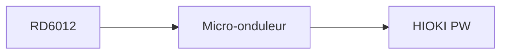

# Exercices - TP Maîtrise des Energies - EI Année 4 Polytech Sorbonne

## Introduction

Ce TP sert d'introduction à la mise en place d'un banc de tests pour module solaire.

Un module solaire transforme l'énergie solaire en énergie électrique (tension continue - DC), lorsqu'on souhaite installer un panneau solaire, on installe aussi un micro-onduleur qui permet la transformation DC/AC. Cette transformation est importante car il faut pouvoir se connecter au réseau EDF qui est un réseau de 230V - 50 Hz. Pour mieux comprendre, voici un schéma :


**PV : photovoltaïque*

Si vous souhaitez plus d'informations sur l'énergie solaire, vous pouvez consulter ce lien :
```
https://www.eniplenitude.fr/en-lumiere/maison-ecologique/solaire/energie-solaire
```

Comme vous devez sûrement le savoir, un panneau solaire n'a pas un très bon rendement avec une limite théorique de 31% d'après le site suivant :
```
https://mypower.engie.fr/conseils/energie-solaire/production-energie-solaire/rendement-panneau-solaire.html
```
Néanmoins, il est toujours important de chercher de nouvelles manières de créer de l'énergie verte.
Avant de commencer à utiliser les cellules photovoltaïques, il vous faudra utiliser l'alimentation RD6012 dont ses documents sont disponibles sur ce GitHub.

---

## Quelques définitions

### 1 - Micro-onduleur

Un micro-onduleur est un appareil électronique utilisé dans les systèmes photovoltaïques (panneaux solaires). Son rôle principal est de convertir le courant continu (DC) produit par un panneau solaire individuel en courant alternatif (AC) utilisable par les appareils électriques ou injecté dans le réseau.

### 2 - Puissance mètre HIOKI

Le PW3335 est un puissancemètre qui peut être utilisé pour réaliser des mesures de puissance pour des appareils monophasés tels que des appareils à batterie ou des appareils ménagers électroniques. Il nous permettra de quantifier les signaux sortants du micro-onduleur.

### 3 - Alimentation RD6012

L’alimentation RD6012 est une alimentation capable de délivrer jusqu’à 60 V et 12 A, alimentée par une source DC externe. Il s'agit d'un module de régulation de tension/courant, destiné à convertir une tension continue brute en une sortie régulée précise. Cette alimentation servira de source pour notre banc de tests.

---

## Début du TP

### Registres de l'alimentation

Il manque plusieurs parties dans le fichier main.js et c'est à vous de les retrouver.
Evidemment, nous ne vous demandons pas de savoir coder dans ces langages mais simplement de retrouver
des informations importantes.

Il est simple d'utiliser des IAs pour un sujet comme celui-ci, cependant, vous n'apprendrez pas grand chose
et le sujet est fait pour être simple et sans prise de tête. Essayez par vous-même d'abord !

---

#### Exercice 1 - Correction du code de l'alimentation

Comme vous pouvez le constater, quelques registres utiles à la communication avec
l'alimentation Riden sont manquants. L'alimentation fonctionne via une communication modbus, 
il vous faudra par exemple retrouver les registres et les adresses des éléments importants.

1° - Allez sur le site suivant :
```
https://drive.google.com/drive/folders/1NdHp_BiQKGyVf5ahfyhNrGkTcO2AzWC0
```
Il contient les étapes pour l'installation de l'application de base de l'alimentation.

2° - Installez l'application et testez la sur votre RD6012.

3° - Installez l'application Serial Port Monitor :
```
https://www.electronic.us/products/serial-port-monitor/post-download/
```

4° - Espionnez le port de communication et retrouvez les adresses des registres décrits plus bas : "!VALEUR!".

---

#### Exercice 2 - Banc de tests

Dans le répertoire Datasets sont disponibles plusieurs simulations, ces simulations vont vous permettre de décrire le comportement d'un panneau solaire suivant différents faits naturels. Pour chaque simulation, décrivez le comportement que peut avoir le panneau solaire.

Pour visualiser les données, vous pouvez utiliser la partie simulation de l'application Electron Fiddle en téléchargeant l'outil sur le site ci-dessous ou en utilisant directement le fichier index.html :
```
https://www.electronjs.org/fr/fiddle
```

---

#### Exercice 3 - Installation du montage

Dans cet exercice, vous allez devoir créer votre propre montage en deux parties. La première consistera a utiliser les datasets pour simuler la présence du panneau solaire et la seconde vous permettra d'utiliser un vrai module solaire.

##### 1ère Partie

Réalisez le montage suivant et pour chaque simulation décrivez comment réagit le micro-onduleur à l'aide du HIOKI.



##### 2ème Partie

1° - Préparez un panneau photovoltaïque à l'extérieur ainsi que le module HIOKI et le micro-onduleur. Il vous faudra également un capteur de luminosité. Relevez les données sur l'inclinaison du panneau, la luminosité à proximité de celui-ci, la puissance fournie, l'heure ainsi que le courant et la tension en sortie du micro-onduleur.

2° - Tracez ensuite la caractéristique IV pour les paramètres idéaux.

## ⚠ Attention ⚠
Essayez au maximum de ne pas faire de l'ombre sur le panneau solaire car cela fait rapidement baisser le courant circulant dans celui-ci et comme la fonction MPPT (Maximum Power Point Tracking) du micro-onduleur est relativement lente, cela vous ferra facilement perdre du temps !